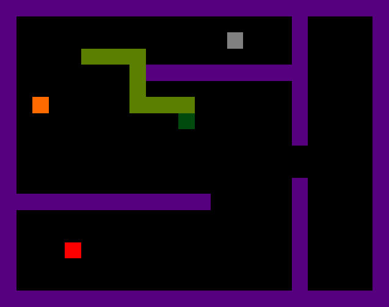

# Zmija 
RP3 project
# BITNO
## Upute za kloniranje repozitorija
* u repozitoriju nema svih datoteka koje VS generira prilikom pokretanja programa nego samo one bitne za *build*
* nakon kloniranja i otvaranja 'Zmijica.sln' trebao bi funkcionirati build projekta
* kod push i pull naredbi se automatski preskaću datoteke opisane u '.gitignore'

## Generalne bilješke
* default kontrole su a,w,s,d, space, shift, numpad brojevi

## TODO
### (Andrija)
* sastaviti tekst za help screen
* dodati svoj dio u prezentaciju

### (Mihael)
* dovršiti svoj dio prezentacije

### (Jakov?)
* maknuti save-button s options screen-a jer se promjene odmah događaju
* help screen mora imati "Main menu" button i "Resume button"
* dodati svoj dio u prezentaciju ? koji dio ?

## Izrada dokumentacije
Kako bi generiranje dokumentacije što bolje teklo treba pogledati [XML tags](https://learn.microsoft.com/en-us/dotnet/csharp/language-reference/xmldoc/recommended-tags#general-tags).
Iznad elemenata koda (članova, klasa, metoda, funkcija) koji se dokumentiraju stavlja se blok komentara kao u primjeru:
```
/// <summary>
/// Standardna funkcija kod programiranja igara.
/// Poziva se kod Load eventa forme. 
/// </summary>
public abstract void Setup();
```
Istražio sam kako pomoću [Doxygen](https://www.doxygen.nl/index.html) generirati dokumentaciju iz *dobro komentiranog* koda.
Ideja je uz minimalne modifikacije koristiti XML tagove i ovaj README.md za generiranje dokumentacije/prezentacije za predaju projekta. 
*Markdown* se koristi i za *Jupyter* bilježnice, ali evo [podsjetnik](https://docs.github.com/en/get-started/writing-on-github/getting-started-with-writing-and-formatting-on-github/basic-writing-and-formatting-syntax). Inicjalni rezultat isprobavanja Doxygen-a je u docs direktoriju. Datoteka s ekstenzijom .rtf se može otvoriti pomoću Word-a. Jedini problem je encoding za dijakritičke znakove u hrv. jeziku. Može se s find-replace popraviti.

# Specifikacija

## Originalni tekst
Igra bi se trebala sastojati od više razina različite težine. Cilj svake razine je npr. dostići određenu duljinu zmije ili neki broj bodova. 

Razine se mogu razlikovati po brzini kretanja zmije, zatim možete dodati neke dodatne prepreke s kojima se zmija ne smije sudariti, možete mijenjati i oblik prostora unutar kojeg se zmija kreće. 

Također, na plohi kretanja se mogu nalaziti predmeti za koje, ako ih zmija pojede, igrač može dobiti dodatne bodove, izgubiti bodove, može prijeći na drugu razinu, može se promijeniti
smjer kretanja zmije ili joj se duljina smanji ili poveća na neki drugi način od uobičajenog. Za neki tip "hrane" postavite da je jasno kako utječe (nekom 2-kombinacijom tipaka neka je moguće dobiti informativni prozor), dok se za drugu "hranu" ponašanje određuje slučajnim odabirom. 

Ubacite na neku razinu mogućnost da se u ovisnosti o nekim događajima pojave mjesta na kojima zmija smije preskočiti samu sebe. Da bi igra tekla dinamičnije, dozvolite brže kretanje zmije na način da pritiskanjem strelica i numeričke tipke pomaknete odjednom zmiju za određen broj polja u zadanom smjeru. S tipkom SHIFT i strelicom smjera, zmija bi trebala ići do samog ruba plohe. Uz neku drugu kombinaciju, pomakne se koliko je najviše moguće u tom smjeru, a da se ne sudari sa samom sobom. 

U postavkama igre igrač može sam namjestiti tipke koje mu odgovaraju za te operacije. 

Na nekoj od viših razina možete ubaciti i drugu zmiju kojom upravlja računalo i koja je protivnik igračevoj zmiji. Cilj je ne sudariti se sa zmijom kojom upravlja računalo. Zmije se naizmjenično pomiču. 

Također neka je moguće dobiti i određen broj pauza u igri. Možete odrediti i broj života koje zmija može potrošiti u igri.

## Bazični izgled

* uglavnom će se koristiti pravokutnici od `TableLayoutPanel` kontrole
* ljubičasto na slici su zidovi
* tamnozelena je glava zmije
* svijetlozelena je tijelo zmije
* šareni pravokutnici su jestivi objekti - vidi [Hrana](#hrana)
## Kontrole
## Win conditions
## Loose conditions
## Hrana
## Game Menu
### Postavke window
### Info window

# Implementacija
## Generalno
### Game loop
treba prevesti : 

Class hierarchy `Form > GameForm > Game` is made to ensure code sustainability. `Game` focuses on methods:
* `Setup` : called on Form.Load event
* `Draw` : called on Application.Idle event
* `[InputEventHandler]` : called on input event

`GameForm` is also an **abstract** class because of mentioned abstract methods implemented in the `Game` class objects.
### `Snake`
